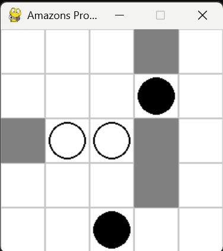

# Amazons Prototype

This repository contains a prototype implementation of the board game **Amazons** built with Python and Pygame. Amazons is a strategic board game reminiscent of chess where each player controls units that move like a queen in chess. On each turn, a player moves a unit and then "shoots" an arrow to create a wall that restricts movement, gradually confining the opponent's pieces.

## Features

- **Customizable Board Settings:**  
  Adjust the board dimensions, cell size, starting positions, and initial player via the `settings.json` file.

- **Game Mechanics:**  
  - **Queen-like Movement:** Units move in straight lines (horizontally, vertically, or diagonally) provided the path is clear.
  - **Arrow Shooting:** After moving, a unit shoots an arrow that leaves a permanent wall, blocking further movement.
  - **Turn-Based State Management:** The game manages states for selecting a piece, moving it, and then shooting an arrow.
  - **Debug Logging:** Detailed debug prints are included to track mouse clicks, grid positions, move validations, and state transitions.

- **Advanced Analysis:**  
  - **Winner Detection:** Checks if the current player has no valid moves left, declaring the opponent the winner.
  - **Flood Fill Separation Check:** Uses an 8-direction flood fill to determine if units are isolated by walls (i.e., no unit can reach an opposing unit).
  - **Flood Fill Area Count:** Calculates the total reachable area for each unit using 8-direction connectivity, offering insight into the potential moves available.

- **Unit Highlighting:**  
  The currently selected unit is highlighted in yellow to provide visual feedback during gameplay.

## Screenshot

See the game in action:



## Installation

1. **Clone the repository:**

   ```bash
   git clone https://github.com/yourusername/amazons-prototype.git
   cd amazons-prototype
